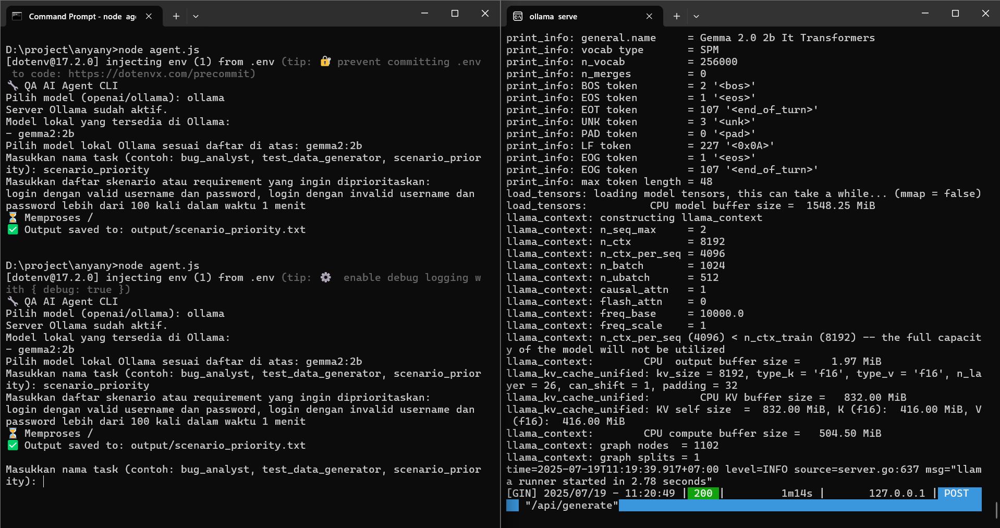

# Anyany.js – Generative AI CLI for Debugging & Testing

A Node.js-based CLI tool that leverages generative AI to assist with debugging, testing, and other quality-related tasks  
Supports both **local models** (via Ollama) and **cloud-based models** (such as OpenAI and OpenRouter)

## ✨ Fitur Utama

## 🎯 Multi-Model & Multi-Provider  
Seamlessly connect with various AI providers:

- **OpenAI**  
  Models like GPT-4o, GPT-4 Turbo, etc

- **OpenRouter**  
  Access to models like Google Gemini, Meta Llama, Mistral, and more

- **Ollama**  
  Run local models such as Llama 3, Gemma 2, etc

---

## 🤖 Advanced Multi-Agent System  
Leverage collaborative AI power with multiple modes:

- **Debate Mode**  
  Two or more agents debate to provide diverse perspectives on a topic

- **Pipeline Mode**  
  The output of one agent becomes the input for the next, refining the response step-by-step

- **Consensus Mode**  
  Multiple agents respond independently, and their answers are synthesized into a comprehensive result

---

## 💾 Persistent Session Management  
Never lose track of your work:

- Sessions are saved automatically.  
- Reload previous sessions to resume conversations or review history
- View, manage, and delete sessions via an interactive menu


## ⚡ Powerful Batch Processing  
Automate repetitive tasks efficiently:

- **File Processing**  
  Run the same task on multiple queries from `.txt` or `.json` files

- **Model Comparison**  
  Test the same query across different AI models to compare performance and results

---

## ⚙️ Flexible Custom Tasks  
Use built-in prompt templates or create your own:

- Leverage pre-defined prompts like `bug_analyst`, `test_data_generator`, and `scenario_priority`
- Add custom instructions at runtime to tailor tasks to your specific needs

---

## 📊 Versatile Export Options  
Save your results in the format you need:

- Export to **Plain Text (.txt)**, **Markdown (.md)**, or **JSON (.json)**
- Generate clean and stylish **HTML reports (.html)** with enhanced Markdown conversion

---

## 🏠 Dynamic Ollama Integration  
Automatically detects Ollama models installed on your local system


## Installation

1. **Clone the repository:**
    ```bash
    git clone git@github.com:modalqa/anyany.js.git
    cd anyany.js
    ```

2. **Install dependencies:**
    ```bash
    npm install
    ```

3. **(Optional) Install `showdown` for better HTML export:**
    ```bash
    npm install showdown
    ```

4. **Copy `.env.example` to `.env` and fill in the required variables:**
    ```bash
    cp .env.example .env
    ```
    Then, open the `.env` file and insert your API key


## Configuration

Open the `.env` file and set your API keys. You only need to fill in the keys for the services you intend to use

```env
# Required for OpenAI models
OPENAI_API_KEY="sk-..."

# Required to access models like Gemini, Llama, etc. via OpenRouter
OPENROUTER_API_KEY="sk-or-..."
```

## Usage

Run the application from your terminal:

```bash
node agent.js
```

You will be greeted with an interactive main menu. Simply choose the option you need:

- **`🔥 Quick Query`**: Ask a single quick question to the AI model of your choice
- **`🤖 Multi-Agent Mode`**: Use collaborative modes like Debate, Pipeline, or Consensus
- **`⚙️ Custom Task`**: Use predefined prompt templates (e.g., bug analysis)
- **`💾 Session Management`**: View, load, create, or delete your conversation sessions
- **`⚡ Batch Processing`**: Process multiple queries from a file or compare model outputs
- **`❌ Exit`**: Exit the application.

The results can be displayed in the terminal or exported to files in the `output/` folder

---

## Example Use Case

### Bug Analysis with Pipeline Mode

Use **Multi-Agent Mode → Pipeline**:

- **Agent 1 (GPT-4o)**: Analyzes error logs to identify potential root causes  
- **Agent 2 (Llama 3 70B)**: Builds upon Agent 1’s analysis to write detailed reproduction steps  
- **Agent 3 (Gemini 1.5 Flash)**: Summarizes the business impact and provides suggested fixes based on the reproduction steps

### Generate Test Data  
Use **Custom Task → `test_data_generator`**
Enter a description of the data you need, and the AI will generate JSON-formatted test data including valid cases, invalid cases, and edge cases

---

### Model Comparison  
Use **Batch Processing → Repeat Query with Different Models**
Enter a single question, such as:

> "Explain the key differences between Playwright and Cypress"

The script will send the query to all configured providers and present a comparison report of the responses

## Demo

<p align="center">
  
</p>

*Note: The above images may not reflect all the latest features*

## Contribution

Pull requests and issues are very welcome!  
Feel free to contribute and help improve the project

---

Copyright (c) modalqa